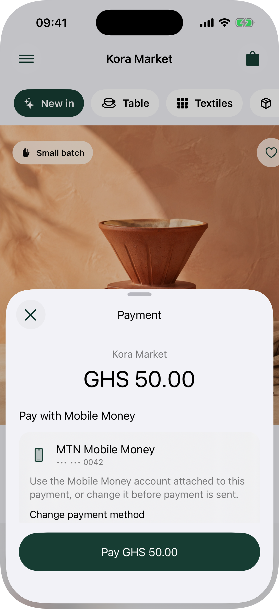
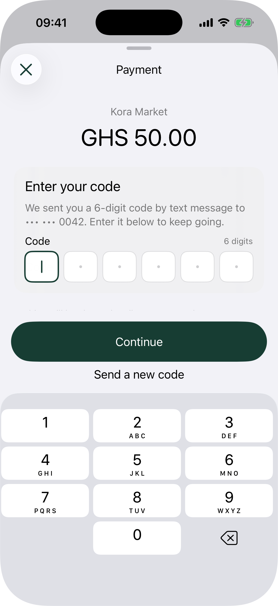
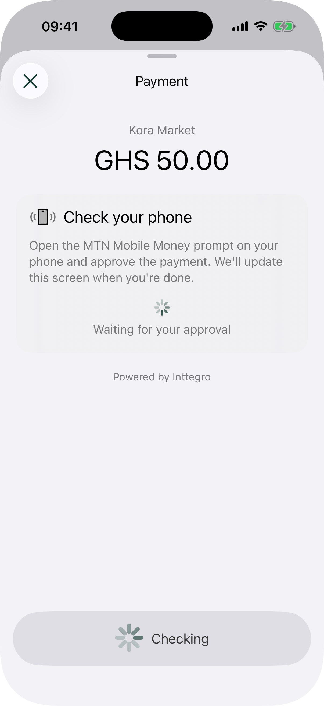
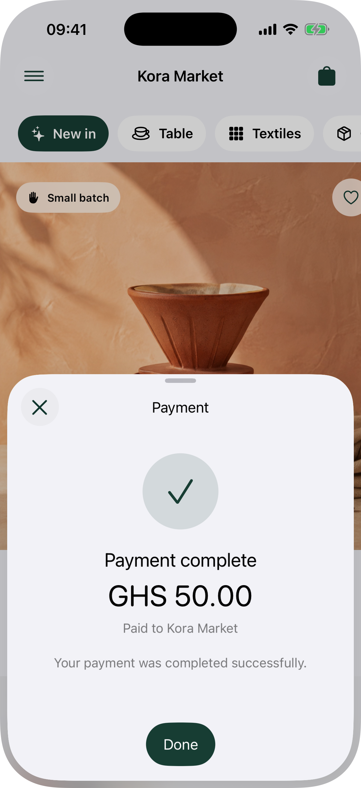

# Inttegro SDK for iOS

[API reference](https://mobile.inttegro.dev/v0.2.0/ios/documentation/inttegro/) ·
[Studio guide](https://studio.inttegro.com/mobile/ios)

Inttegro's native iOS payment sheet collects payment without sending secret API
keys through your application.

## Install

In Xcode, choose **File → Add Package Dependencies** and enter:

```text
https://github.com/inttegro/inttegro-sdk-ios.git
```

Or add Inttegro to your package manifest:

```swift
dependencies: [
    .package(
        url: "https://github.com/inttegro/inttegro-sdk-ios.git",
        from: "0.2.0"
    ),
]
```

Then import the module:

```swift
import Inttegro
```

SwiftUI applications can present `InttegroPaymentSheet` directly or use the
`inttegroPaymentSheet` view modifier. UIKit applications can use
`PaymentSheet.present(from:completion:)`.

The native artifact is available as the `Inttegro` Swift package and is also
configured for CocoaPods distribution. React Native and Flutter integrations
share its `PaymentSheetCoordinator` bridge instead of reimplementing checkout
or presentation behavior.

## Native payment flow

<table>
  <tr>
    <td></td>
    <td></td>
  </tr>
  <tr>
    <td></td>
    <td></td>
  </tr>
</table>

These are genuine iPhone Simulator captures of this SwiftUI payment sheet. A
deterministic demo adapter supplies non-sensitive checkout data and never sends
a payment.

Only pass the public Checkout Order ID created by your backend. Never embed
`INTTEGRO_API_KEY` in an iOS application. The default adapter retrieves the
checkout from `https://api.inttegro.com/checkout/lookup` and submits a supported
attached payment method or newly entered mobile-money details to `/checkout/pay`
with an idempotency key. Optional billing details describe the payer; the SDK
does not send or change shipping details. Card and Apple Pay are not supported
in this version and are not exposed in configuration or UI.

Use `PaymentSheetConfiguration.Features` to opt into line-item presentation or
invoice and receipt downloads on the completed sheet. Those three capabilities
default to off. `allowPaymentMethodChange` defaults to `true`; set it to `false`
when an attached payment method must not be replaced. Orders without an
attached method still collect one.

The native sheet supports payer-supplied mobile-money and billing-detail forms,
plus confirmation-code request and submission. HTTPS provider redirects open
in `SFSafariViewController`; provider or device approval keeps the sheet in a
waiting state while it refreshes the public Checkout projection. A response
that needs an unsupported action or is still processing is never reported as a
completed payment.

## Telemetry

UIKit hosts can receive the same ordered lifecycle and network event stream as
the cross-platform SDKs:

```swift
let configuration = try PaymentSheetConfiguration(
    orderID: orderID,
    telemetry: .init(
        traceParent: currentTraceParent,
        traceState: currentTraceState
    )
)
let sheet = PaymentSheet(
    configuration: configuration,
    telemetryEventHandler: { event in
        recordInttegroEvent(event)
    }
)
```

`InttegroPaymentSheet` and the `inttegroPaymentSheet` modifier accept the same
`telemetryEventHandler`. Inttegro does not install an exporter; the host maps
events into its own OpenTelemetry provider, logs, or diagnostics. Events never
contain Order or Payment IDs, customer or payer data, payment-method details,
bodies, redirect URLs, or raw error messages.
